# 問卷報告生成系統

這是一個以 FastAPI 建立的問卷報告生成系統。使用者可以上傳 Word、Excel、PDF 或圖片附件，系統會解析文件內容、整理成結構化資料，交由 OpenAI LLM 生成報告 JSON，最後套用 Word 範本輸出 `.docx` 報告。

## 功能

- 上傳多個文件附件
- 支援 `.docx`、`.csv`、`.xlsx`、`.pdf`、`.jpg`、`.jpeg`、`.png`
- 解析 Word 段落、表格、勾選項與合併儲存格
- 解析 Excel / CSV 表格與多工作表資料
- 解析 PDF 文字與表格
- 使用 OpenAI Vision 分析圖片
- 將所有來源整理成 `NormalizedDocument`
- 使用 OpenAI 生成具 evidence 的 `ReportJSON`
- 過濾沒有 evidence 的 LLM 生成內容，降低幻覺風險
- 套用 Word 範本輸出正式報告
- 提供 Web UI 與 API

## 技術棧

- Python
- FastAPI
- Uvicorn
- Pydantic
- OpenAI Python SDK
- python-docx
- docxcompose
- pandas
- openpyxl
- pdfplumber
- matplotlib
- HTML / CSS / Vanilla JavaScript

## 專案結構

```text
app/
  main.py
  config.py
  routes/
    report.py
  models/
    schemas.py
  parsers/
    questionnaire_docx_parser.py
  prompts/
    report_prompts.py
    report_schema.py
    questionnaire_prompts.py
    questionnaire_schema.py
    vision_prompts.py
  services/
    extractors/
      docx_extractor.py
      table_extractor.py
      pdf_extractor.py
      image_extractor.py
      factory.py
    normalizer.py
    report_planner.py
    docx_renderer.py
    image_analyzer.py
    analysis_chart_generator.py
  static/
    app.js
    style.css
  templates/
    index.html
  tests/
tools/
uploads/
outputs/
requirements.txt
.env.example
```

## 生成報告流程

```mermaid
flowchart LR
    A[使用者上傳文件] --> B[Web UI 送出 FormData]
    B --> C[FastAPI /generate-report]
    C --> D[Extractor 解析檔案]
    D --> E[ExtractedSource]
    E --> F[Normalizer 整理來源並抽出 facts]
    F --> G[NormalizedDocument]
    G --> H[ReportPlanner 壓縮成 LLM payload]
    H --> I[OpenAI 生成 ReportJSON]
    I --> J[後端檢查 evidence]
    J --> K[DocxRenderer 套用 Word 範本]
    K --> L[outputs/ 產生 DOCX]
    L --> M[Web UI 顯示下載連結]
```



```text
使用者上傳文件
→ Web UI 送出 FormData
→ FastAPI 接收 /generate-report
→ 儲存檔案到 uploads/
→ Extractor 依檔案類型解析
→ 產生 ExtractedSource
→ Normalizer 整理來源並抽出 facts
→ 形成 NormalizedDocument
→ ReportPlanner 篩選 facts 並壓縮成 LLM payload
→ OpenAI 生成 ReportJSON
→ 後端檢查 evidence
→ DocxRenderer 套用 Word 範本
→ 輸出 DOCX 到 outputs/
→ Web UI 顯示下載連結
```

## 核心資料階段

```text
原始檔案
→ ExtractedSource
→ NormalizedDocument
→ LLM payload
→ ReportJSON
→ DOCX 報告
```

### ExtractedSource

單一檔案解析後的標準資料物件。不同格式的檔案都會被轉成同一種結構，方便後續統一處理。

常見內容包含：

- `source_name`
- `type`
- `paragraphs`
- `tables`
- `blocks`
- `text`
- `image_analysis`
- `warnings`

### NormalizedDocument

所有檔案整理後的總資料包，包含：

- `project_name`
- `hospital_name`
- `template_id`
- `sources`
- `facts`
- `warnings`

其中 `facts` 是由 Normalizer 從段落、表格、圖片分析與勾選項中抽出的重點資料。

### LLM payload

ReportPlanner 會從 `NormalizedDocument` 中挑選重要 facts，限制段落、表格列數與文字長度，形成適合傳給 LLM 的精簡 JSON。

### ReportJSON

LLM 回傳的結構化報告內容。系統要求診斷段落、建議與 key findings 附上 evidence。沒有 evidence 的 LLM 內容會被過濾，避免無來源內容進入 Word 報告。

## 安裝

建立虛擬環境：

```powershell
python -m venv .venv
.venv\Scripts\Activate.ps1
```

安裝依賴：

```powershell
pip install -r requirements.txt
```

## 環境變數

複製 `.env.example` 為 `.env`：

```powershell
Copy-Item .env.example .env
```

設定 OpenAI API key：

```env
OPENAI_API_KEY=your_api_key
OPENAI_MODEL=gpt-4o-mini
APP_NAME=AI Report Generator Backend
APP_VERSION=0.1.0
```

不要把 `.env` 上傳到 GitHub。

## 啟動

```powershell
uvicorn app.main:app --reload
```

啟動後可開啟：

- Web UI: `http://127.0.0.1:8000/`
- API 狀態: `http://127.0.0.1:8000/api/status`
- Swagger UI: `http://127.0.0.1:8000/docs`

## API

### `GET /`

回傳 Web UI。

### `GET /api/status`

回傳服務狀態。

### `POST /generate-report`

產生問卷報告。

表單欄位：

- `project_name`
- `hospital_name`
- `template_id`
- `files`

回傳：

- `success`
- `normalized_preview`
- `report_json`
- `output_file`
- `download_url`

### `POST /validate-questionnaire`

解析第一個 DOCX 問卷，回傳問卷理解結果。

### `POST /convert-questionnaire`

將第一個 DOCX 問卷轉成：

- `raw_json`
- `normalized_json`
- `report_input_json`

### `GET /download/{file_name}`

下載 `outputs/` 中的報告檔案。

## 測試

```powershell
python -m unittest discover app\tests
```


